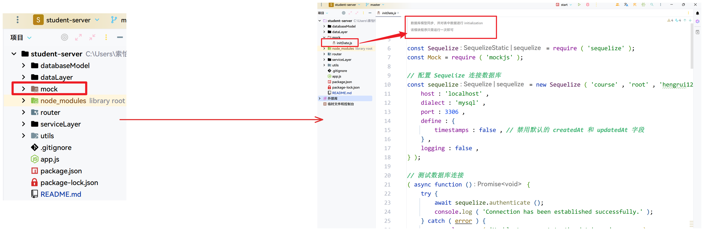

# Student-Server

## 操作手册

1. 首先安装依赖 ，运行命令 `npm install ` 。
2. 在MySQL创建一个名为 `course` 的数据库。
3. `单独`执行本项目中 `mock` 文件夹中的   `initDate.js` 。

> 目的是初始化数据库中的数据，也就是将`模拟`数据填充数据库
>
> - 首先进入本项目所在路径然后运行如下命令
>
> 命令： `node mock/initDate.js`   (在终端中运行)

4. 最后运行 `npm run start` 启动本项目。
